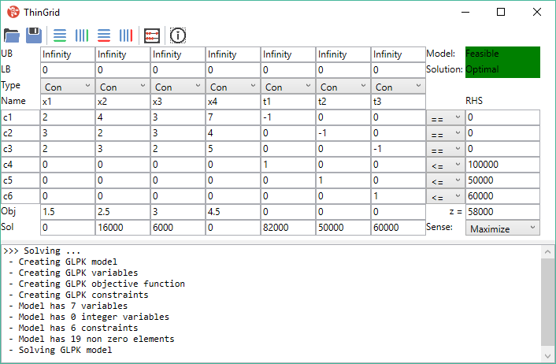

# ThinGrid
The ThinGrid software is intended to be used as a very basic tool to support the first steps into mathematical modeling. We hope that it is useful in providing a first impression of Operational Research techniques.
Copyright (C) 2016 Marius Merschformann, Lin Xie

This program is free software: you can redistribute it and/or modify
it under the terms of the GNU General Public License as published by
the Free Software Foundation, either version 3 of the License, or
(at your option) any later version.

This program is distributed in the hope that it will be useful,
but WITHOUT ANY WARRANTY; without even the implied warranty of
MERCHANTABILITY or FITNESS FOR A PARTICULAR PURPOSE.  See the
GNU General Public License for more details.

You should have received a copy of the GNU General Public License
along with this program.  If not, see <http://www.gnu.org/licenses/>.

# Screenshot

# Used software:
We would like to thank the authors of the following software for enabling us to quickly implement this piece of software.
## Optimization.Framework: ##
The Optimization.Framework allows you to use C# as a modelling language for mathematical optimization. It furthermore allows you to use solvers as services.
Copyright © Lars Beckmann
http://optimizationzen.com/license
## GLPK: ##
The GLPK package is part of the GNU project, released under the aegis of GNU.
Copyright © 2000, 2001, 2002, 2003, 2004, 2005, 2006, 2007, 2008, 2009, 2010, 2011, 2012 Andrew Makhorin, Department for Applied Informatics, Moscow Aviation Institute, Moscow, Russia. All rights reserved.
Free Software Foundation, Inc., 51 Franklin Street, Fifth Floor, Boston, MA 02110-1301, USA.
Verbatim copying and distribution of this entire article are permitted worldwide, without royalty, in any medium, provided this notice, and the copyright notice, are preserved.
